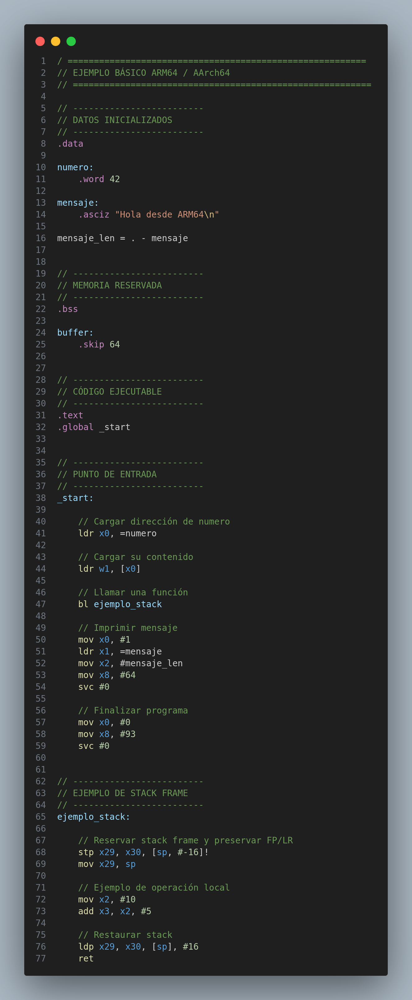
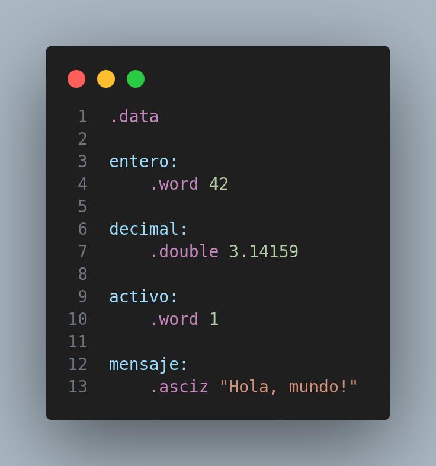
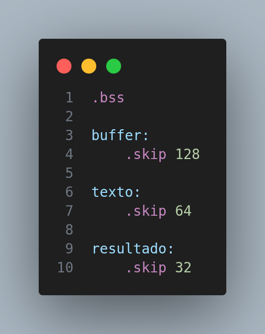
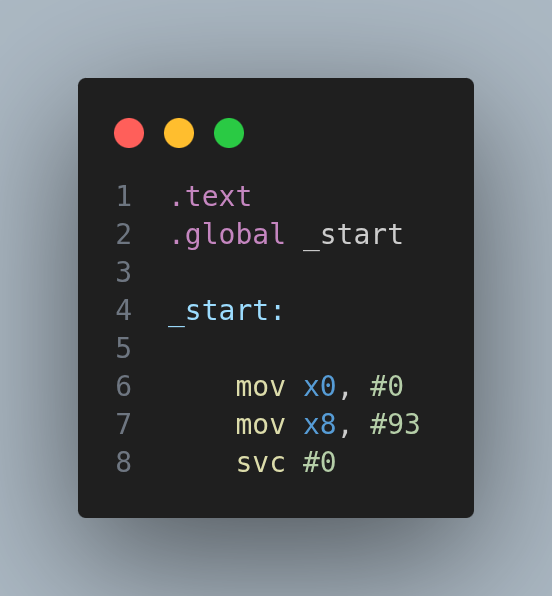

# ARM64/AArch64: memoria, registros e instrucciones

Este documento explica cómo se organiza un archivo ensamblador ARM64, qué papel tienen `.data`, `.bss`, `.text` y `.global _start`, cómo aparecen el stack y el heap durante la ejecución, y cómo interpretar instrucciones y registros frecuentes.

!!! info "Distinción esencial"

    `.data`, `.bss` y `.text` son secciones del archivo ensamblador. El **stack** y el **heap** no suelen declararse como `.stack` o `.heap`: son regiones de memoria disponibles durante la ejecución.

---

## 1. Mapa general de memoria de un programa

Una forma sencilla de explicarlo es:

```text
Direcciones altas
┌──────────────────────────────┐
│            STACK             │
│ Variables locales            │
│ Parámetros temporales        │
│ Direcciones de retorno       │
│ Registros preservados        │
│                              │
│          crece ↓             │
├──────────────────────────────┤
│                              │
│         espacio libre        │
│                              │
├──────────────────────────────┤
│          crece ↑             │
│            HEAP              │
│ Memoria dinámica             │
│ Cadenas/arreglos dinámicos   │
│ Objetos de tamaño variable   │
├──────────────────────────────┤
│            .bss              │
│ Datos globales sin valor     │
│ inicial explícito            │
├──────────────────────────────┤
│            .data             │
│ Datos globales inicializados │
├──────────────────────────────┤
│            .text             │
│ Código ejecutable            │
└──────────────────────────────┘
Direcciones bajas
```

Este dibujo es conceptual. La distribución exacta depende del sistema operativo, el enlazador y mecanismos como ASLR.

---

## 2. Sección `.data`

## ¿Para qué sirve?

`.data` contiene datos que ya tienen un valor inicial antes de empezar la ejecución.

Ejemplos típicos:

```asm
.data

numero:     .word 42
decimal:    .double 3.14159
activo:     .word 1
mensaje:    .asciz "Hola ARM64"
newline:    .asciz "\n"
```

En el código generado por el proyecto aparecen precisamente valores como enteros, flotantes, booleanos y cadenas inicializadas.

## Directivas comunes

### `.word`

Reserva y almacena una palabra de 32 bits:

```asm
numero: .word 42
```

Puede utilizarse para:

- enteros de 32 bits;
- booleanos representados como `0` o `1`;
- constantes numéricas.

---

### `.double`

Almacena un flotante de doble precisión, 64 bits:

```asm
pi: .double 3.14159
```

Se accede normalmente mediante registros SIMD/FP como:

```asm
d0
d1
d2
```

Ejemplo:

```asm
ldr x0, =pi
ldr d0, [x0]
```

---

### `.asciz`

Guarda una cadena terminada en byte nulo `\0`:

```asm
mensaje: .asciz "Hola"
```

En memoria:

```text
H  o  l  a  \0
```

El byte `\0` permite saber dónde termina la cadena.

---


**`.data`: almacena datos globales o estáticos que ya poseen un valor inicial antes de ejecutar el programa.**

Ejemplos:

```text
int       → .word
bool      → .word
f64       → .double
string    → .asciz
```

---

## 3. Sección `.bss`

## ¿Para qué sirve?

`.bss` se utiliza para reservar memoria para datos globales que todavía no necesitan un contenido concreto en el archivo ejecutable.

Ejemplo:

```asm
.bss

buffer:    .skip 128
texto:     .skip 64
resultado: .skip 32
```

Aquí no estamos diciendo:

```text
buffer = "Hola"
```

Estamos diciendo:

```text
reservar 128 bytes para buffer
```

Por eso `.bss` es ideal para:

- buffers;
- cadenas que se construirán durante la ejecución;
- áreas temporales;
- arreglos cuyo espacio se conoce pero cuyo contenido se llenará después.

---

## `.skip`

Reserva cierta cantidad de bytes:

```asm
buffer: .skip 128
```

Significa:

```text
buffer → espacio de 128 bytes
```

En tu código generado esto se utiliza para variables como buffers de salida y temporales.

---

**`.bss`: reserva memoria para datos que serán llenados durante la ejecución y no necesitan almacenarse con un valor inicial dentro del ejecutable.**

Ejemplo visual:

```asm
.bss
salida: .skip 128
texto:  .skip 64
```

---

## 4. Sección `.text`

## ¿Para qué sirve?

`.text` contiene las instrucciones ejecutables.

Ejemplo:

```asm
.text

_start:
    mov x0, #0
    mov x8, #93
    svc #0
```

Aquí están instrucciones como:

```text
mov
ldr
str
add
sub
cmp
b
bl
ret
svc
```

También aquí se colocan las funciones auxiliares:

```asm
println:
    ...

int_to_str:
    ...

copiar_string:
    ...
```

---

**`.text`: contiene el código máquina que será ejecutado por el procesador.**

---

## 5. `.global _start`

Una línea muy importante es:

```asm
.global _start
```

Esto hace visible el símbolo `_start` para el enlazador.

Después:

```asm
_start:
```

define la etiqueta donde comenzará la ejecución del programa.

En un programa ensamblador enlazado directamente con `ld`, `_start` actúa como punto de entrada.

Ejemplo:

```asm
.text
.global _start

_start:
    // primera instrucción
```

---

## Diferencia con `main`

En C normalmente se piensa en:

```c
int main() {
}
```

pero el sistema operativo no entra directamente a una función C escrita por el programador. Existe código de arranque que finalmente llama a `main`.

Cuando trabajamos en ensamblador puro y enlazamos directamente con `ld`, podemos definir nosotros:

```asm
_start:
```

y controlar el punto inicial.

---

**`.global _start` exporta el símbolo `_start`, y `_start:` marca el punto de entrada del programa.**

---

## 6. Stack

## Qué es

El stack es memoria utilizada principalmente para:

- variables locales;
- valores temporales;
- parámetros que no caben o no conviene mantener en registros;
- registros que una función debe preservar;
- dirección de retorno;
- stack frames.

En AArch64 el registro:

```text
sp
```

es el **Stack Pointer**.

`sp` apunta a la posición actual de la pila.

---

## 7. Ejemplo real de stack frame

Una secuencia típica es:

```asm
stp x29, x30, [sp, #-16]!
mov x29, sp
```

y al terminar:

```asm
ldp x29, x30, [sp], #16
ret
```

Esto puede explicarse así.

## Entrada a la función

```asm
stp x29, x30, [sp, #-16]!
```

`stp` significa:

```text
Store Pair
```

Guarda dos registros juntos.

Se guardan:

```text
x29 → Frame Pointer
x30 → Link Register
```

y se reservan 16 bytes en el stack.

Después:

```asm
mov x29, sp
```

establece el frame pointer de la función actual.

---

## Salida de la función

```asm
ldp x29, x30, [sp], #16
```

`ldp` significa:

```text
Load Pair
```

Recupera `x29` y `x30` y restaura `sp`.

Finalmente:

```asm
ret
```

regresa a la dirección almacenada en `x30`.

---

## 8. x29 y x30

## x29 — Frame Pointer

Convencionalmente:

```text
x29 = FP = Frame Pointer
```

Ayuda a mantener una referencia estable al stack frame actual.

---

## x30 — Link Register

```text
x30 = LR = Link Register
```

Cuando se ejecuta:

```asm
bl funcion
```

el procesador almacena automáticamente en `x30` la dirección a la que debe regresar.

Por eso:

```asm
ret
```

normalmente vuelve a la dirección guardada en `x30`.

---

## 9. Heap

## Qué es

El heap es memoria dinámica solicitada durante la ejecución.

Se utiliza cuando el tamaño o tiempo de vida del dato no se conoce completamente al ensamblar el programa.

Ejemplos conceptuales:

```text
strings dinámicos
arrays dinámicos
structs creados durante ejecución
buffers cuyo tamaño cambia
listas
árboles
```

---

## Muy importante

No suele existir:

```asm
.heap
```

de la misma forma que existe:

```asm
.data
.bss
.text
```

El heap es una región de memoria administrada durante la ejecución.

En Linux se puede obtener memoria mediante llamadas al sistema como:

```text
brk
mmap
```

o mediante un runtime/allocator, por ejemplo `malloc`, si el programa está enlazado con una biblioteca que lo provea.

En un compilador académico también se puede implementar un heap propio sobre una región reservada.

---

## 10. Stack vs Heap

| Stack | Heap |
|---|---|
| Manejado principalmente mediante `sp` | Administrado mediante allocator o llamadas al sistema |
| Muy rápido | Más flexible |
| Variables locales | Objetos dinámicos |
| Stack frames | Strings/arrays dinámicos |
| Tamaño normalmente estructurado por función | Tamaño solicitado durante ejecución |
| Se libera al retirar el frame | Debe administrarse explícitamente o por runtime |

---

## 11. Registros generales x0–x30

ARM64 dispone de registros generales de 64 bits:

```text
x0  ... x30
```

Sus versiones de 32 bits se llaman:

```text
w0  ... w30
```

Ejemplo:

```text
x0 = 64 bits
w0 = parte baja de 32 bits del mismo registro
```

Si escribimos:

```asm
mov w0, #10
```

el valor queda en los 32 bits bajos y la arquitectura pone a cero los bits superiores de `x0`.

---

## 12. Registros x0–x7

Según la convención de llamadas AArch64, los primeros argumentos de una función se pasan habitualmente en:

```text
x0
x1
x2
x3
x4
x5
x6
x7
```

Por ejemplo:

```asm
mov x0, #10
mov x1, #20
bl sumar
```

Conceptualmente:

```text
sumar(10, 20)
```

El resultado de una función suele devolverse en:

```text
x0
```

o en `w0` si el resultado es de 32 bits.

---

## 13. x19–x28

Los registros:

```text
x19 ... x28
```

son registros **callee-saved** según la convención AArch64.

Eso significa que una función que los modifica debe restaurarlos antes de regresar.

Son útiles para conservar valores durante varias llamadas a funciones.

En tu código aparece, por ejemplo:

```asm
mov x20, x0
```

para guardar temporalmente un puntero base.

Cuando se escribe código completamente conforme a la convención de llamadas, si una función modifica `x20`, debe preservar/restaurar su valor para el llamador.

---

## 14. `mov`

`mov` copia o coloca un valor en un registro.

Ejemplo inmediato:

```asm
mov x0, #1
```

equivale conceptualmente a:

```text
x0 = 1
```

Otro ejemplo:

```asm
mov x20, x0
```

equivale a:

```text
x20 = x0
```

No mueve físicamente un registro; copia el valor.

---

## 15. `ldr`

`ldr` significa:

```text
Load Register
```

Se utiliza para cargar información.

Ejemplo:

```asm
ldr x0, =mensaje
```

Esto carga en `x0` la dirección asociada a `mensaje`.

Conceptualmente:

```text
x0 = &mensaje
```

Después:

```asm
ldr w1, [x0]
```

significa:

```text
w1 = memoria[x0]
```

Es decir, ahora se lee el contenido almacenado en esa dirección.

---

## 16. Diferencia fundamental

Estas dos instrucciones no hacen lo mismo:

```asm
ldr x0, =numero
```

y:

```asm
ldr w1, [x0]
```

La primera obtiene la dirección:

```text
x0 = &numero
```

La segunda obtiene el contenido:

```text
w1 = numero
```

Ejemplo:

```asm
.data
numero: .word 42

.text
ldr x0, =numero
ldr w1, [x0]
```

Al final:

```text
x0 → dirección de numero
w1 → 42
```

---

## 17. `str`

`str` significa:

```text
Store Register
```

Guarda el contenido de un registro en memoria.

Ejemplo:

```asm
str w1, [x0]
```

Conceptualmente:

```text
memoria[x0] = w1
```

---

## 18. `ldrb` y `strb`

La `b` significa:

```text
byte
```

Ejemplo:

```asm
ldrb w3, [x1]
```

lee un byte.

```asm
strb w3, [x0]
```

escribe un byte.

Son muy útiles para recorrer strings carácter por carácter.

---

## 19. `add` y `sub`

Suma:

```asm
add x0, x1, x2
```

Conceptualmente:

```text
x0 = x1 + x2
```

Resta:

```asm
sub x0, x1, x2
```

Conceptualmente:

```text
x0 = x1 - x2
```

También pueden utilizar inmediatos:

```asm
add x0, x0, #1
sub x0, x0, #1
```

---

## 20. `mul`

Multiplicación:

```asm
mul x0, x1, x2
```

Conceptualmente:

```text
x0 = x1 * x2
```

---

## 21. `sdiv`

División con signo:

```asm
sdiv x0, x1, x2
```

Conceptualmente:

```text
x0 = x1 / x2
```

Para división sin signo existe:

```asm
udiv
```

---

## 22. `cmp`

Compara dos valores:

```asm
cmp x0, x1
```

Internamente se comporta como una resta para actualizar las banderas del procesador, pero no guarda el resultado.

Luego puede utilizarse un salto condicional.

---

## 23. Saltos condicionales

Ejemplos frecuentes:

```text
b.eq  → igual
b.ne  → diferente
b.gt  → mayor
b.ge  → mayor o igual
b.lt  → menor
b.le  → menor o igual
```

Ejemplo:

```asm
cmp x0, x1
b.eq iguales
```

---

## 24. `cbz` y `cbnz`

`cbz`:

```text
Compare and Branch if Zero
```

Ejemplo:

```asm
cbz w0, terminar
```

equivale conceptualmente a:

```text
if w0 == 0:
    goto terminar
```

`cbnz`:

```text
Compare and Branch if Not Zero
```

---

## 25. `b`

Salto incondicional:

```asm
b ciclo
```

equivale a:

```text
goto ciclo
```

---

## 26. `bl`

`bl` significa:

```text
Branch with Link
```

Se utiliza para llamar funciones:

```asm
bl println
```

Al hacerlo:

```text
PC salta a println
x30 guarda la dirección de retorno
```

Luego:

```asm
ret
```

regresa al llamador.

---

## 27. `ret`

Finaliza una función y normalmente continúa desde la dirección almacenada en `x30`.

```asm
ret
```

---

## 28. Registros de punto flotante

Para valores `f64` se utilizan registros:

```text
d0
d1
d2
...
```

Ejemplo:

```asm
ldr x0, =decimal
ldr d0, [x0]
```

Aquí:

```text
x0 → dirección
d0 → valor f64
```

---

## 29. `svc`

`svc` significa:

```text
Supervisor Call
```

Permite solicitar un servicio al kernel.

En Linux AArch64, el número de syscall se coloca en:

```text
x8
```

y los argumentos normalmente se colocan empezando en:

```text
x0, x1, x2, ...
```

Finalmente:

```asm
svc #0
```

transfiere el control al kernel.

---

## 30. Ejemplo: syscall `write`

En Linux AArch64:

```text
write = syscall 64
```

Los parámetros son conceptualmente:

```c
write(fd, buffer, cantidad)
```

Antes del `svc`:

```text
x0 = fd
x1 = dirección del buffer
x2 = cantidad de bytes
x8 = 64
```

Ejemplo:

```asm
mov x0, #1
ldr x1, =mensaje
mov x2, #5
mov x8, #64
svc #0
```

Aquí:

```text
x0 = 1        → stdout
x1 = mensaje  → dirección
x2 = 5        → bytes
x8 = 64       → syscall write
```

---

## 31. Ejemplo: syscall `exit`

En Linux AArch64:

```text
exit = syscall 93
```

Ejemplo:

```asm
mov x0, #0
mov x8, #93
svc #0
```

Conceptualmente:

```text
exit(0)
```

---

## 32. Tablas de syscall


> ARM64 define las instrucciones del procesador, pero servicios como imprimir, leer archivos, abrir archivos o terminar un proceso son proporcionados por el sistema operativo. En Linux AArch64 se consulta la tabla de system calls para conocer el número que debe colocarse en `x8` y los argumentos que deben ir en `x0`, `x1`, `x2`, etc.

Ejemplos comunes en Linux AArch64:

```text
read      → 63
write     → 64
exit      → 93
brk       → 214
mmap      → 222
```

Los números de syscall dependen de la ABI/sistema operativo, por lo que deben consultarse en una tabla apropiada para AArch64.

---

## 33. Código Basico de ARM64/AArch64

Este ejemplo muestra claramente:

- `.data`
- `.bss`
- `.text`
- `.global _start`
- `_start`
- lectura/escritura de memoria
- llamada a función
- stack frame
- syscall `write`
- syscall `exit`




---

## 34. Cómo compilar el ejemplo

```bash
aarch64-linux-gnu-as -o ejemplo.o ejemplo.s
aarch64-linux-gnu-ld -o ejemplo.elf ejemplo.o
qemu-aarch64 ./ejemplo.elf
```

---

## 35. Ejemplo `.data`



> **Sección `.data`**  
> Contiene variables globales o estáticas con un valor inicial. El ensamblador coloca estos datos dentro del ejecutable para que ya estén disponibles al comenzar el programa.

---

## 36. Ejemplo `.bss`



> **Sección `.bss`**  
> Reserva memoria para variables o buffers cuyo contenido se generará durante la ejecución. Permite reservar espacio sin almacenar todos esos bytes como datos inicializados dentro del archivo ejecutable.

---

## 37. Ejemplo `.text`



> **Sección `.text`**  
> Contiene las instrucciones ejecutables. `_start` representa el punto inicial del programa cuando se enlaza directamente como un ejecutable ARM64.

---

## 38. Ejemplo separado para explicar stack

```asm
mi_funcion:

    stp x29, x30, [sp, #-16]!
    mov x29, sp

    // cuerpo de la función

    ldp x29, x30, [sp], #16
    ret
```

> **Stack**  
> Durante una llamada a función se puede reservar un stack frame para conservar registros, variables locales y la información necesaria para regresar al llamador. `sp` controla la posición actual de la pila; `x29` se utiliza convencionalmente como frame pointer y `x30` contiene la dirección de retorno.

---

## 39. Ejemplo separado para explicar heap

Para una introducción no recomiendo comenzar directamente con `mmap`, porque mezcla conceptos de arquitectura con servicios específicos de Linux.

Primero conviene mostrar:

```text
HEAP
Memoria solicitada durante ejecución

Ejemplos:
- strings dinámicos
- arrays dinámicos
- structs
- buffers variables
```

> El heap no se define como `.data` o `.bss`. El programa solicita memoria en tiempo de ejecución mediante un allocator, un runtime o llamadas del sistema operativo como `brk` o `mmap`.

---

## 40. Cómo relacionarlo con un compilador

En un compilador, una tabla de símbolos podría decidir dónde almacenar cada elemento.

Ejemplo conceptual:

```text
variable global inicializada
        ↓
      .data

variable global sin inicialización
        ↓
      .bss

variable local
        ↓
      stack

objeto dinámico
        ↓
      heap

instrucciones generadas
        ↓
      .text
```

Esto es especialmente útil para explicar por qué el compilador debe conocer:

- tipo;
- tamaño;
- alcance;
- tiempo de vida;
- ubicación de memoria.

---

## 41. Relación con el traductor

En el archivo ARM64 generado por el proyecto ya se observa una división clara:

```text
.data
    ↓
datos inicializados

.bss
    ↓
buffers y memoria reservada

.text
    ↓
instrucciones

.global _start
_start:
    ↓
entrada del programa
```

También aparecen funciones auxiliares para:

```text
copiar strings
convertir int → string
convertir float → string
convertir bool → string
imprimir
comparar strings
```

Estas funciones forman una pequeña capa de runtime generada junto con el programa.

En la función de conversión de flotantes ya se utiliza un stack frame convencional mediante `sp`, `x29` y `x30`.

---
